# ENGSE203 LAB 4 — Student Evidence README

## ผู้จัดทำ

- ชื่อ–นามสกุล: นาย ปัณณวัฒน์ สิทธิตัน
- รหัสนักศึกษา: 68543210035-0
- Section: 1

## URLs

- Repository: [engse203-student-labs-68543210035](https://github.com/beem35/engse203-student-labs-68543210035.git)
- Pull Request: -
- GitHub Pages: -

## Component Tree

```text
App
├── AppHeader
├── SummaryPanel
├── RequestForm
├── FilterBar
└── RequestList
    └── RequestCard
```

## Setup และ Run

```bash
nvm use
npm install
npm run dev
npm run check
npm run build
npm run preview
```

## State / Props / Callback Explanation

State:

```text
- App.jsx เป็น Component ที่อยู่บนสุดที่สามารถแจกจ่ายข้อมูลให้ Component ลูกๆ เช่น Summary, List, Filter ได้พร้อมกัน
- App.jsx เป็นผู้ถือครอง State ได้แก่ requests และ statusFilter
```

Props:

```text
- App.jsx ส่งข้อมูลให้ลูกๆ ผ่าน Props เช่น requests ไปให้ RequestList เพื่อสร้างการ์ด หรือส่ง summary ไปให้ SummaryPanel แสดงตัวเลข
```

Callback:

```text
- RequestForm อยู่ด้านล่าง มันไม่สามารถไปแก้ State requests ของ App ได้ตรงๆ App.jsx จึงส่ง "ฟังก์ชัน" (เช่น handleAddRequest) ลงมาให้ RequestForm ผ่าน Prop ที่ชื่อ onAddRequest
- พอผู้ใช้กด Submit ตัว RequestForm ก็จะเรียกใช้ Callback ตัวนี้ พร้อมโยนข้อมูลที่กรอก (formData)  "สวนทาง" กลับขึ้นไปให้ App อัปเดต State
```

## Test Evidence

| Test ID                | Actual Result                                                                                                                   | Pass/Fail | Evidence/Screenshot               |
| ---------------------- | ------------------------------------------------------------------------------------------------------------------------------- | --------- | --------------------------------- |
| TC-01 Initial          | หน้าเว็บโหลดข้อมูลเริ่มต้นแสดงผล 3 รายการได้ถูกต้อง และตัวเลขใน SummaryPanel ตรงกับข้อมูล(Total: 3)                             | Pass      | 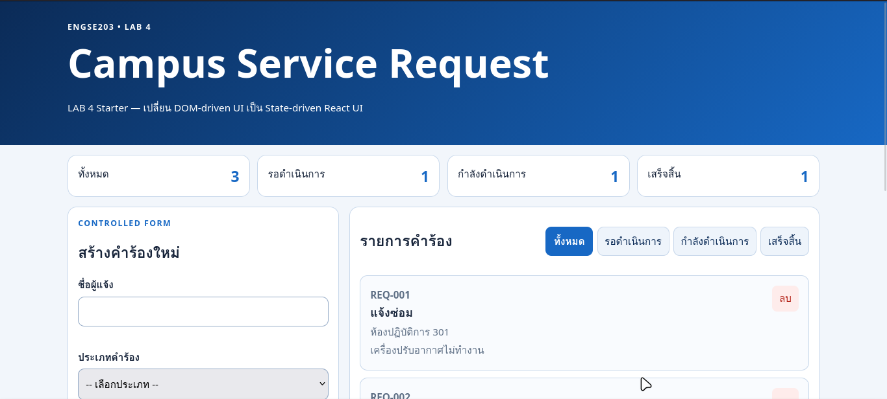 |
| TC-02 Controlled input | ผู้ใช้สามารถพิมพ์ข้อความ ลบ และเลือก Dropdown ได้ตามปกติ ข้อมูลอัปเดตตามที่พิมพ์เรียบร้อย                                       | Pass      | 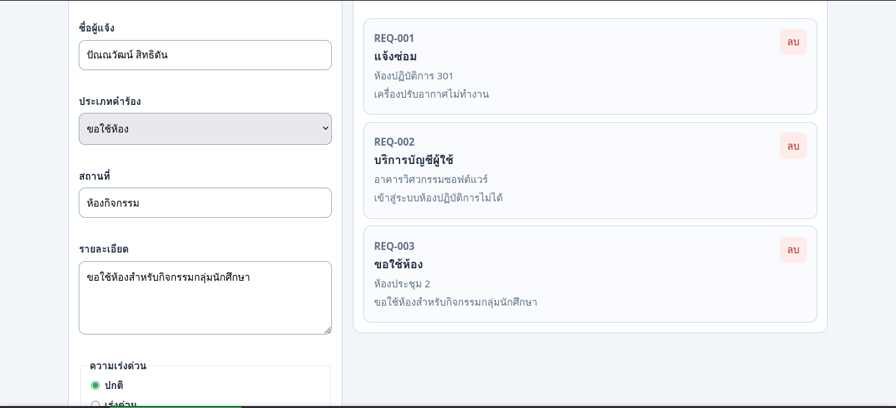 |
| TC-03 Invalid          | ระบบป้องกันไม่ให้เพิ่มคำร้อง และแสดงข้อความ Error สีแดงใต้ช่องกรอกข้อมูลที่ผิดเงื่อนไขอย่างถูกต้อง                              | Pass      | 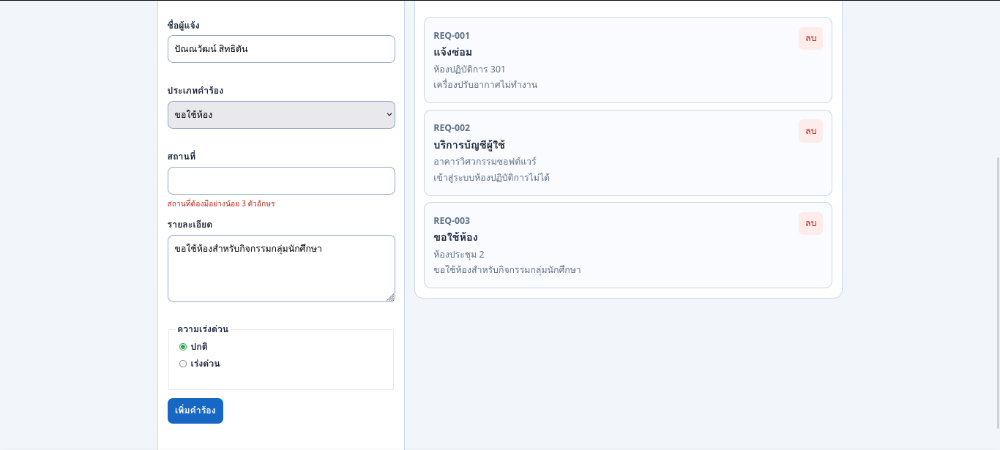 |
| TC-04 Valid add        | คำร้องใหม่ถูกเพิ่มขึ้นไปอยู่บนสุดของรายการ, ฟอร์มถูกเคลียร์ค่ากลับเป็นหน้าว่าง และตัวเลข Summary(Pending และ Total) เพิ่มขึ้น 1 | Pass      | 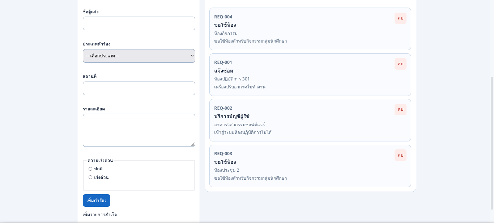 |
| TC-05 Filter           | รายการคำร้องแสดงผลเฉพาะการ์ดที่มีสถานะ 'รอดำเนินการ' เท่านั้น การ์ดอื่นถูกซ่อนชั่วคราว                                          | Pass      | 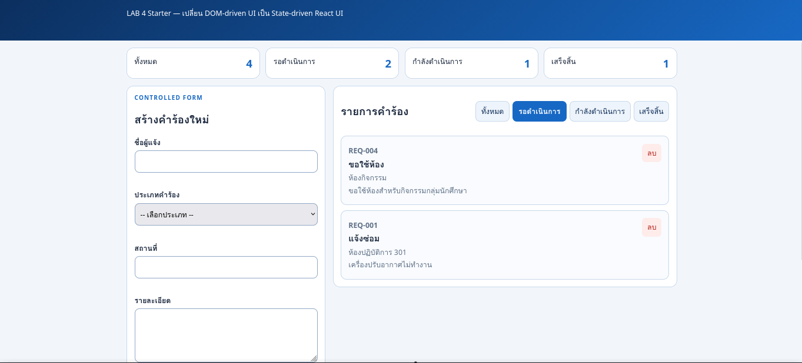 |
| TC-06 All              | ระบบยกเลิกการกรอง และกลับมาแสดงการ์ดคำร้องทั้งหมดทุกสถานะบนหน้าจออีกครั้ง                                                       | Pass      | 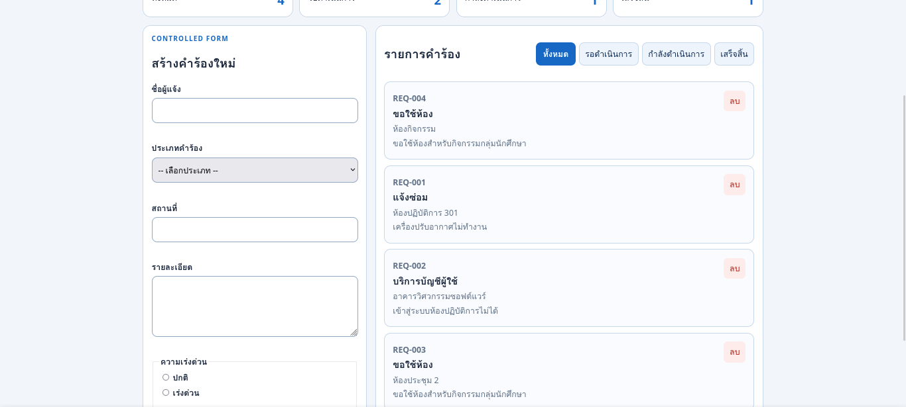 |
| TC-07 Empty            | เมื่อไม่มีการ์ดคำร้อง หน้าจอจะแสดงข้อความ Empty State เช่น 'ไม่มีรายการคำร้อง' ขึ้นมาแทนพื้นที่ว่าง                             | Pass      | 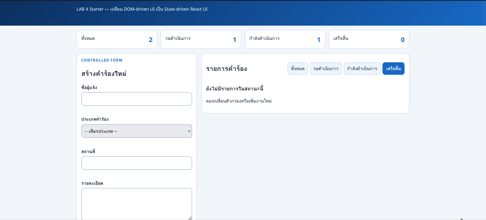 |
| TC-08 Delete           | การ์ดคำร้องใบนั้นหายไปจากรายการทันที และตัวเลขในกล่อง Summary Panel อัปเดตลดลงอย่างถูกต้อง                                      | Pass      | 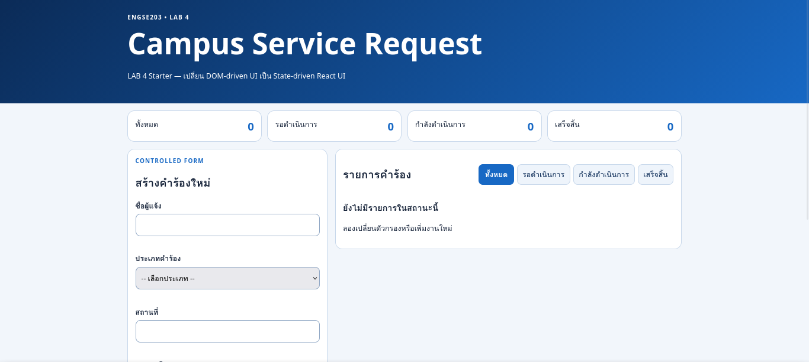 |
| TC-09 Mobile           | Layout หน้าเว็บปรับเปลี่ยนให้ฟอร์มอยู่ด้านบนและรายการอยู่ด้านล่าง ไม่ล้นจอ และสามารถใช้งานได้ปกติ                               | Pass      | 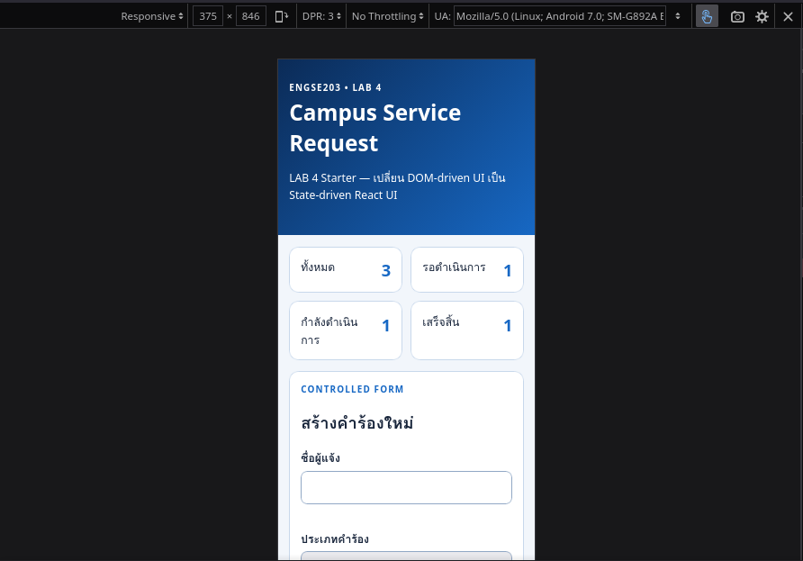 |
| TC-10 Keyboard         | สามารถใช้ปุ่ม Tab เลื่อนโฟกัส (Focus) ไปตามช่อง Input, Dropdown และสามารถกด Enter เพื่อกดปุ่มต่างๆ ได้โดยไม่ต้องใช้เมาส์        | Pass      | 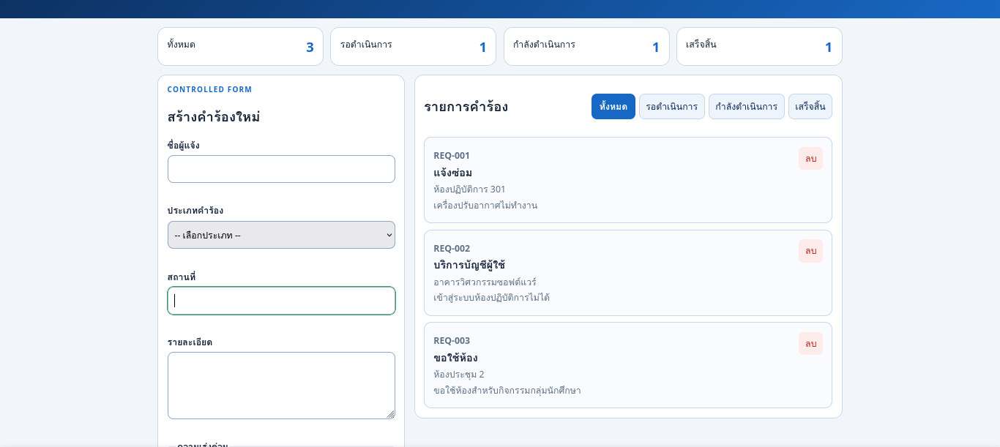 |
| TC-11 Build            | ระบบสามารถแพ็กไฟล์ (Build) จนเสร็จสมบูรณ์โดยไม่มี Error แจ้งเตือน และได้โฟลเดอร์ dist ออกมา                                     | Pass      | 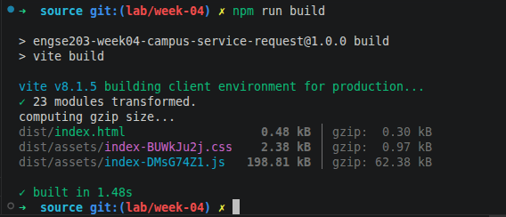 |
| TC-12 Pages            | สามารถเปิดดูเว็บเวอร์ชัน Build บนพอร์ต Localhost ได้หน้าเว็บแสดงผลและฟังก์ชันทุกอย่างทำงานได้ปกติเหมือนตอนรัน dev              | Pass      | 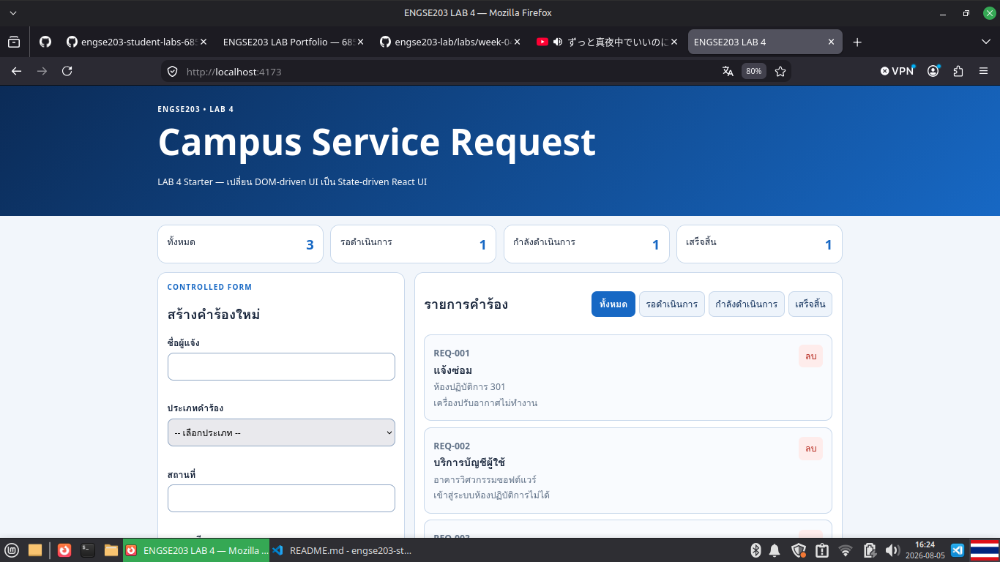 |

## Screenshots

- Desktop:
  
- Mobile 375px:
  
- Validation/empty state:
  

## Week 03 → Week 04 Reflection

Week 03 (DOM Mutation): ต้องมองหา Element(document.getElementById), สร้างแท็กใหม่,จัดยัดเข้า Class, แล้วค่อยเอาไปแทรกในหน้าเว็บ

Week 04 (State-driven UI): ใช้ State เมื่อมีการอัปเดต React จะรู้ว่าต้องทำอะไรแล้วจัดการเปลี่ยนหน้าจอ สามารถเขียน Html เข้าได้เลยไม่ต้องใข้ DOM

## AI / External Resource Disclosure

เครื่องมือที่ใช้: Google Antigravity / Gemini

1. ให้อ่านไฟล์ App.jsx และอธิบายการทำงานภาพรวม รวมถึงช่วยแยกแยะว่า Component ใดบ้างที่ถูกใช้งานและไม่ได้ถูกใช้งาน
2. ขอคำแนะนำในการนำโครงสร้าง Controlled Form จาก TaskForm.jsx มาประยุกต์ใช้กับ RequestForm.jsx
3. สอบถามสาเหตุของ Error Data is not defined ในขณะที่กำลังทำฟังก์ชัน handleAddRequest
4. สอบถามเทคนิคการสร้าง ID แบบรันตัวเลขต่อเนื่อง (เช่น REQ-004, REQ-005) และทฤษฎีการทำ Immutable Add ใน React
5. ขอคำแนะนำในการเขียนสรุปทฤษฎี State/Props, การเปรียบเทียบ Week 3 กับ Week 4 และแนวทางการทำตาราง Test Evidence

ส่วนที่นำมาปรับใช้ในโปรเจ็กต์:

• โครงสร้างของฟังก์ชัน handleChange และ handleSubmit สำหรับผูก State เข้ากับ Input ใน RequestForm.jsx  
 • การแก้ไข Typo เล็กๆ น้อยๆ ในโค้ด (เช่น เปลี่ยน Data.now() เป็น Date.now())  
 • โลจิกในการหาตัวเลข ID สูงสุดแล้วบวกหนึ่ง พร้อมใช้ .padStart() เพื่อสร้างรูปแบบรหัส REQ-XXX ใน App.jsx

Prompt / คำถามสำคัญที่ใช้ถาม AI:

• นำแนวทางที่ AI อธิบายมาเรียบเรียงใหม่เพื่อใช้สรุปทฤษฎีและเขียนผล Test Evidence ลงในไฟล์ README.md

วิธีตรวจสอบความถูกต้อง:

• นำโค้ดที่ได้รับการแนะนำมาทดลองรันจริง (npm run dev) ว่าสามารถแก้ Error ได้จริงและหน้าเว็บไม่พัง
• ทดลองใช้ React Developer Tools (หรือตรวจสอบผ่าน Console) เพื่อดูว่า State formData และ requests
ถูกอัปเดตอย่างถูกต้องตรงตามที่ผู้ใช้พิมพ์และกดปุ่มหรือไม่
• รันสคริปต์ npm run check เพื่อตรวจสอบว่าโค้ดผ่านเงื่อนไข Immutable Add และปราศจากการทำ DOM Mutation ตามกฎของโปรเจ็กต์
